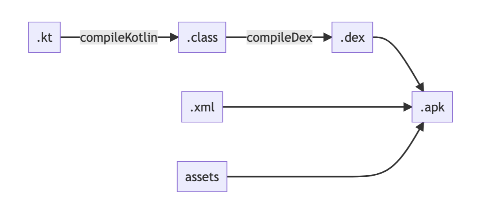

안드로이드 어플리케이션이 apk 파일로 빌드되고, 실제 사용자의 기기에서 실행되기 까지의 경로를 **빌드 과정** / **실행 환경** 두 사이드로 쪼개어 정리해 보려고 한다.

> - 안드로이드 앱 빌드는 어떤 과정으로 구성되는가?
> - 실제 안드로이드 앱을 실행시키는 주체는 무엇이며, 이걸 알아서 무슨 도움이 되는가?

등등의 질문에 답변을 할 수 있는 글이 되도록 작성 중이다.
이 글에서는 **빌드 과정(apk 가 만들어지는 과정)** 에서 어떤 일이 일어나는지 정리해 보았다.

## 실행 가능한 앱 결과물 (.apk) 을 만드는 과정
안드로이드 앱을 만들고, 실제 실행시킬 수 있는 단위는 `.apk` 파일이다. 우리는 IDE 를 통해서 `.apk` 을 만들거나, 직접 커맨드라인을 통해서 `.apk` 를 만들기도(`gradle assemble`) 한다. 이렇게 배포가능하고 실행가능한 apk 파일이 만들어지기 까지 어떤 일이 일어나는지 확인해보자.


> 실제 apk 파일이 프로젝트로 부터 만들어 지는 과정을 간추리면 위 도식화된 경로와 같다. 이를 참고하여 자세한 경로를 정리해 보았다.

#### 코드 파일 컴파일하기
android 는 기본적으로 jvm 기반의 런타임 위에서 돌아가는 코드이다. 그래서 우리가 작성한 kotlin(java) 코드는 런타임에서 인식할 수 있는 bytecode 형태로 컴파일 되어야 한다.

여기서 bytecode 는 일반적인 `kotlinc`, `javac` 로 컴파일된 `.class` 파일이 아닌, 추가적인 최적화가 진행된 `.dex` 파일로의 변환을 필요로 한다. 기존에는 dx compiler 가 이 역할을 수행했지만, 최근 [d8 compiler](https://developer.android.com/studio/command-line/d8?hl=ko) 로의 전환이 진행되고 있으니 관심이 있다면 차이점을 찾아보아도 좋을 것 같다.

정리하자면, 우리가 작성한 kotlin/java 코드는 빌드 시 `kotlinc` / `javac` 와 `d8 compiler` 를 거쳐 안드로이드 런타임이 인식 가능한 .dex 파일로 변환되는 과정을 거친다.

#### 코드 외에 필요한 파일들 모으기
코드 외에도 앱을 실행시키기 위해서는 코드에서 참조하는 image, xml 과 같은 resource 파일들 또한 최종 결과물에 포함되어야 한다. 추가로, 앱을 실행 시키기 위해 필요한 메타 데이터(앱의 진입점 클래스는 무엇인지, 앱 실행 시 필요로 하는 권한이 무엇인지 등)를 담고 있는 파일들 (e.g. AndroidManifest.xml) 또한 같이 포함되어야 한다. 

#### 묶어서 압축한 .apk 파일 만들기
이제 이렇게 열심히 정제한 file 들을 하나의 파일로 압축하면 .apk 파일을 만들 수 있다. 검증을 위해 실제로 빌드된 .apk 파일을 압축해제 하여 내용물을 살펴보자.

```shell
$ unzip app-debug.apk -d result
$ ls result
AndroidManifest.xml
META-INF
classes.dex
classes2.dex
classes3.dex
classes4.dex
kotlin
res
resources.arsc
```

앞서 이야기한 `.dex` 파일, `AndroidManifest.xml`, `res` 등이 한 곳에 묶여 있는 모습을 확인할 수 있다.

또한, 실제로 앱을 빌드하는 과정에서도 해당 task 들이 실행되는 것을 확인할 수 있다.
```shell
$ ./gradlew assembleDebug
:app:preBuild SKIPPED
:app:preDebugBuild SKIPPED
# ...생략
:app:processDebugManifest SKIPPED
# ...생략
:app:compileDebugKotlin SKIPPED
:app:javaPreCompileDebug SKIPPED
:app:compileDebugJavaWithJavac SKIPPED
# ...생략
:app:generateDebugAssets SKIPPED
:app:mergeDebugAssets SKIPPED
:app:compressDebugAssets SKIPPED
# ...생략
:app:mergeExtDexDebug SKIPPED
:app:mergeLibDexDebug SKIPPED
:app:dexBuilderDebug SKIPPED
# ...생략
:app:packageDebug SKIPPED
:app:createDebugApkListingFileRedirect SKIPPED
:app:assembleDebug SKIPPED

BUILD SUCCESSFUL in 398ms
```

#### 마무리

간단한 앱의 빌드 과정을 정리해 보았지만, 실제 빌드에서 일어나는 다양한 과정을 살펴보고 싶다면 위에서 언급한 gradle task 실행 경로의 task 들을 하나하나 뜯어 본다면 더욱 깊은 이해를 할 수 있을 것이다.

예시를 들자면, 코틀린 파일이 컴파일 되는 과정, 어노테이션 프로세싱 과정, 코드 난독화/최소화 과정, java sugaring, 앱 사이닝, apk 파일과 aab 파일이 무엇이 다른지... 등이 있으니 관심이 있다면 각각의 주제를 더 깊이 뜯어보아도 재밌을 것 같다.


#### 참고한 글
- https://developer.android.com/studio/build?hl=ko
- https://developer.android.com/studio/command-line/d8?hl=ko
- https://medium.com/mindorks/compilers-in-android-studio-3-2-cc7e68446d09

