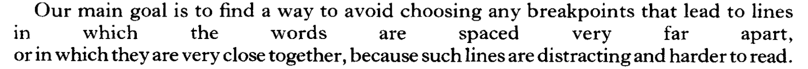
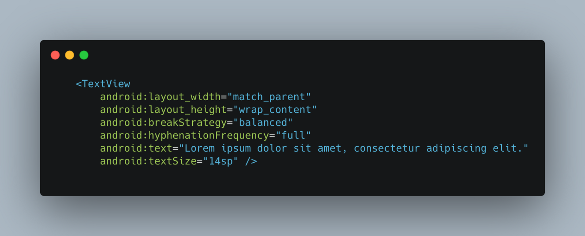
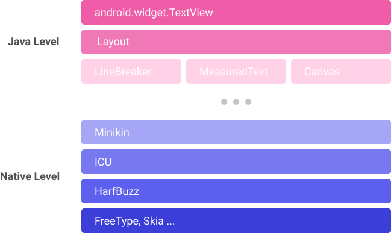
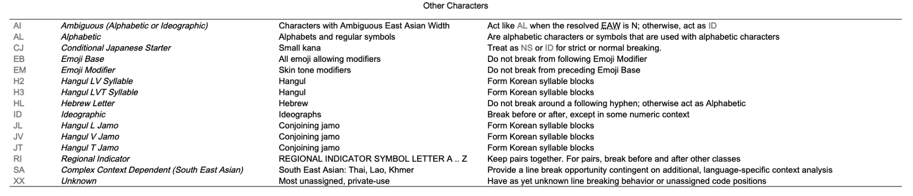
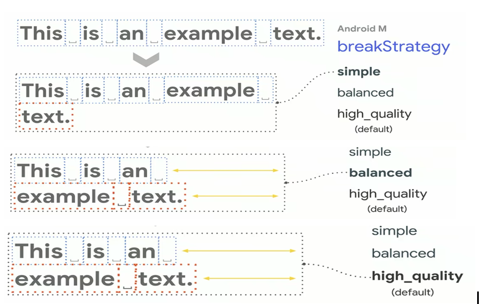

> 본 글은 [미디엄에 게시된 제 게시글](https://san5g.medium.com/android-textview-%ED%86%BA%EC%95%84%EB%B3%B4%EA%B8%B0-text-layout-measuring-7f928f6c9af1)의 복사본입니다.

문자열 (CharSequence) 은 독자의 가독성을 고려하여 문자를 어떻게 배열해야할지 많은 부분을 고민해야 합니다.

- 줄 간격은 어떻게 처리하지?
- view width 를 넘어가는 text 들은 어떻게 넘기는가?
- 특정 언어는 단어가 잘리면 읽기 힘들지 않을까?
- 단어가 잘려 넘어갈 때 hyphen (-) 을 쓰면 어떨까?

<br />

*DONALD E. KNUTH AND MICHAEL F. PLASS, 'Breaking Paragraphs into Lines'*
<br />

대부분의 GUI 를 지원하는 framework 들은 위 고민을 해결하여 추상화 시킨 API 를 사용자들에게 제공합니다. 이번 글에서는 Android 의 text layouting 을 [AOSP](https://source.android.com/) 에서 어떻게 구현 하였는지 알아보려고 합니다.

### Android 의 Text Layout Measuring


*Android 의 TextView attributes*

Android 에서는 `android.widget.TextView`클래스를 통해 텍스트 레이아웃 측정을 도와주고 있습니다. 앞서 언급한 Layout Measuring 에 관한 다양한 디테일(text size, line breaking strategy, hyphenation frequency) 들은 대부분 xml attributes 로 조정이 가능하여 해당 attributes 에 맞추어 배치된 글자들이 화면에 그려지게 됩니다.

#### Code Stack for Text Layout Measuring

Android의 `TextView` 에서 사용되는 Layout Measuring 구현은 resource consuming 한
부분들이 많아 내부 구현의 상당수가 cpp native code 로 작성되어 있습니다.

`TextView` 의 Layout Measuring 에 관련된 구현은 아래의 Code Stack 의 코드를 통해 확인할 수 있습니다. 본 글에서도 이 code stack 에서 언급된 library 들을 위주로 설명이 진행됩니다.


_Code Stack Diagram from [Deep dive in Android Text And Best Practice](https://medium.com/mindorks/deep-dive-in-android-text-and-best-practices-part-1-6385b28eeb94)_

**Java Layer** - Layout, MeasuredText, LineBreaker

- TextView 는 내부적으로 Layout 을 사용합니다. 이때 Layout 은 LinearLayout 과 같은 view level 의 layout 이 아닌 오로지 text 의 layout 만을 처리하는 지엽적인(?) 클래스 입니다.
- Layout 은 추상 클래스로 EditText 를 위한 DynamicLayout, 간단한 줄바꿈 없는 텍스트를 위해 최적화된 BoringLayout, 일반적인 고정 텍스트들을 위한 StaticLayout 3개의 구현체를 가지고 있습니다. (본 글에서는 StaticLayout 을 위주로 설명할 예정입니다.)
- Layout 은 텍스트의 레이아웃 측정을 위해 MeasuredText, LineBreaker등의 class 를 사용하고 있습니다.
- Layout 은 위 클래스에서 얻은 정보를 바탕으로 그래픽화된 문자(자체) 를 Canvas 에 그려줍니다.

> MeasuredText 와 LineBreaker 는 내부적으로 cppnative code 를 호출하고 있으며, 이 호출에 대응하는 class 들은 minikin library 에 구현되어 있습니다.

**cpp Native Layer** - minikin, ICU, HarfBuzz...

- [Minikin](https://android.googlesource.com/platform/frameworks/minikin/) 은 AOSP 내부에 존재하는 cpp 로 구현된 layout measurement 및 line breaking 을 도와주는 library 입니다.
- [ICU](https://github.com/unicode-org/icu) 는 unicode 처리를 돕는 library 로 언어별로 상이한 LineBreaking spec 을 unicode 규약에 따라 제공하고 있어 minikin 에서 사용하고 있습니다.
- [HarfBuzz](https://github.com/harfbuzz/harfbuzz) 는 text shaping library 로 텍스트와 font 의 자체 matching 을 위해 minikin 에서 사용하고 있습니다.
- 그 외에도 더욱 깊은 곳에서 실제 그래픽 렌더링을 도와주는 Skia, 글꼴 렌더링을 도와주는 FreeType 등의 라이브러리 들이 사용 되고 있습니다.

이번 글에서는 `Layout.java` ~ minikin 정도 범위의 코드를 살펴보며 안드로이드의 text layout measuring 을 톺아보려고 합니다.

---

### 코드와 함께 톺아보기

AOSP 의 코드를 이제 직접 훑어 보며 Android 의 Text Layout Measuring 과정을 살펴볼 것입니다. Measuring 과정은 간략하게 아래와 같습니다.

1. Glyphs Measuring: 유니코드 -> 화면상의 graphic 으로 픽셀 크기를 확인한다.
2. Line Breaking: view width 를 넘어가는 텍스트를 사용자가 읽을 수 있도록 텍스트의 중간 중간 줄넘김 처리를 해준다.
3. Drawing, 위 과정에서 계산된 값들을 바탕으로 화면에 텍스트를 그려 준다.

#### 1) Glyphs Measuring

`Layout` 은 텍스트를 어떻게 배치할 것이며, 텍스트의 줄넘김이 언제 일어날지 알아야 합니다. 이를 위해 필요한 첫 번째 요소가 텍스트를 각 [자체](https://ko.wikipedia.org/wiki/%EC%9E%90%EC%B2%B4)(Glyphs,문자를 그래픽화 시켜 나타낸 형태) 로 매핑하여 Glyph 의 사이즈를 확인하는 과정입니다.

이 과정은 minikin 의 `MeasuredText` 클래스에서 구현을 확인할 수 있습니다. Unicode 로 이루어진 문자열 HarfBuzz 를 통해하여 Glyph 의 배열 형태로 매핑한 후 width measuring 을 진행합니다. 이때 measuring 된 결과는 캐싱하여 glyph 매핑 횟수를 줄이고 있습니다.

```cpp
if (paintId == LayoutPieces::kNoPaintId) {
    LayoutCache::getInstance().getOrCreate(
            textBuf.substr(context), piece - context.getStart(), mPaint, info.isRtl,
            StartHyphenEdit::NO_EDIT, EndHyphenEdit::NO_EDIT, compositor);
} else {
    precomputed->getOrCreate(textBuf, piece, context, mPaint, info.isRtl,
                             StartHyphenEdit::NO_EDIT, EndHyphenEdit::NO_EDIT, paintId,
                             compositor);
}
```

> frameworks/minikin/libs/minikin/MeasuredText.cpp

#### 2) Line Breaking

Line Breaking 은 view width 보다 긴 텍스트를 view 에 넣으려고 할 시 적절한 위치에서 줄넘김 처리를 해 주어 사용자가 전체 텍스트를 가독성 좋게 읽을 수 있도록 도와주는 과정입니다. 이 과정은 줄넘김 처리가 발생할 수 있는 후보군을 찾는 단계와, Line Breaking Strategy 에 따라 최종 줄넘김 처리가 발생하는 구간을 찾아내는 단계로 나눠볼 수 있습니다.

줄넘김 처리가 발생할 수 있는 지점 (이하 중단점) 은 각 unicode Locale 별로 차이가 있습니다. 해당 Unicode 규약은 [여기](https://www.unicode.org/reports/tr14/)에서 볼 수 있는데, 예를 들자면 영어의 경우에는 한 단어의 중간 에서는 줄넘김 처리가 발생할 수 없고, (만약 발생한다면 `-` 표시를 추가해 주어야 합니다.) 한글의 경우 한 단어 사이 음절에서 줄넘김 처리가 발생할 수 있습니다.


*Locale 별 중단점을 잡는 방법*

Line Break 를 구현한 minikin 의 `LineBreaker` 에서는 위에서 언급한 Locale 별 후보 중단점들을 unicode library 인 ICU 를 사용하여 찾아내고, Line Break 가 어디에서 일어나야 하는지를 설정한 Strategy 에 따라 계산해 주는 코드가 구현되어 있습니다.

AOSP 의 LineBreak 는 현재 3가지의 Line Break Strategy 를 지원합니다.


*Line Breaking strategy comparison from [Deep dive in Android Text And Best Practice](https://medium.com/mindorks/deep-dive-in-android-text-and-best-practices-part-1-6385b28eeb94)*

1. **Simple (Greedy) Break Strategy** 는 LineBreak 의 후보 (~= 종단점) 을 하나씩 보면서 이 줄에 넣을 수 있는 최대한의 텍스트를 집어넣고 나머지는 다음줄로 넘깁니다.
2. **Balanced Break Strategy** 는 [TeX 의 LineBreaking 알고리즘](http://www.eprg.org/G53DOC/pdfs/knuth-plass-breaking.pdf)을 구현하고 있습니다. 위 알고리즘은 hyphen 을 활용하여 전반적으로 텍스트 한줄 한줄의 길이가 비슷하도록 최적화 시켜주어 가독성을 높여줍니다.
3. **High Quality Break Strategy** 도 마찬가지로 TeX 의 LineBreaking 알고리즘을 활용하지만 Balanced 와 다르게 마지막 줄은 다른 줄들과 비슷한 길이가 아니여도 괜찮도록 알고리즘의 최적화 metric 중 하나인 penalty를 조절하는 차이가 있습니다.


*balanced vs high_quality*

```cpp
if ((atEnd || !justified) && delta < 0) {
    widthScore = SCORE_OVERFULL;
} else if (atEnd && strategy != BreakStrategy::Balanced) {
    // increase penalty for hyphen on last line
    additionalPenalty = LAST_LINE_PENALTY_MULTIPLIER * candidates[j].penalty;
} else {
```

_frameworks/minikin/libs/minikin/OptimalLineBreaker.cpp_

#### 3) Drawing

이제 LineBreaker 와 MeasuredText (~=MeasuredParagraph) 를 통해 계산된 위치 값에 맞추어 실제 View Canvas 에 텍스트를 그려줍니다. 이 과정은 `StaticLayout.java` 를 통해 확인할 수 있습니다.

```cpp
if (paragraphInfo == null) {
    final PrecomputedText.Params param = new PrecomputedText.Params(paint, textDir,
            b.mBreakStrategy, b.mHyphenationFrequency);
    paragraphInfo = PrecomputedText.createMeasuredParagraphs(source, param, bufStart,
            bufEnd, false /* computeLayout */);
}
```

_frameworks/base/core/java/android/text/StaticLayout.java_

`PrecomputedText` 는 MeasuredText 등의 계산해야할 정보들을 미리 계산해서 들고 있는 class 입니다. (이번 글에서는 중요하게 다루지 않을 예정입니다) 이미 계산해 두었던 MeasuredParagraph 가 없을 경우 `PrecomputedText.createMeasuredParagraphs` 를 통해 Text Measuring 을 진행합니다. (해당 함수 안 깊숙한 곳에서 MeasuredText 의 native call 이 이뤄집니다)

```java
LineBreaker.Result res = lineBreaker.computeLineBreaks(
      measuredPara.getMeasuredText(), constraints, mLineCount);
int breakCount = res.getLineCount();
if (lineBreakCapacity < breakCount) {
  lineBreakCapacity = breakCount;
  breaks = new int[lineBreakCapacity];
  lineWidths = new float[lineBreakCapacity];
  ascents = new float[lineBreakCapacity];
  descents = new float[lineBreakCapacity];
  hasTabs = new boolean[lineBreakCapacity];
  hyphenEdits = new int[lineBreakCapacity];
}

for (int i = 0; i < breakCount; ++i) {
  breaks[i] = res.getLineBreakOffset(i);
  lineWidths[i] = res.getLineWidth(i);
  ascents[i] = res.getLineAscent(i);
  descents[i] = res.getLineDescent(i);
  hasTabs[i] = res.hasLineTab(i);
  hyphenEdits[i] =
      packHyphenEdit(res.getStartLineHyphenEdit(i), res.getEndLineHyphenEdit(i));
}
```

_frameworks/base/core/java/android/text/StaticLayout.java_

계산된 `MeasuredText` 는 `LineBreaker` 에 넘겨져 실제 LineBreaking 알고리즘을 수행합니다. 이후 cpp native 에서 계산된 결과 값을 바탕으로 `StaticLayout` 은 줄 길이별 width, 줄 길이 별 Char Sequence Offset 등을 계산하여 Layout 의 해당 정보 getter 함수를 override 합니다.

```java
// StaticLayout.java
// ...
    @Override
    public int getLineTop(int line) {
        return mLines[mColumns * line + TOP];
    }
// ...


// Layout.java
// ...
   public void drawText(Canvas canvas, int firstLine, int lastLine) {
      int previousLineBottom = getLineTop(firstLine);
      int previousLineEnd = getLineStart(firstLine);
// ...
```

_frameworks/base/core/java/android/text/Layout.java_

이렇게 override 된 계산 값들(e.g. `mLines`)은 `StaticLayout` 의 부모인 `Layout::drawText` 에서 사용되어 화면에는 계산된 값들을 바탕으로 텍스트가 그려지게 됩니다.

#### Reference

- http://defoe.sourceforge.net/folio/knuth-plass.html#knuth
- https://medium.com/mindorks/deep-dive-in-android-text-and-best-practices-part-1-6385b28eeb94
- http://www.eprg.org/G53DOC/pdfs/knuth-plass-breaking.pdf
- https://harfbuzz.github.io/why-do-i-need-a-shaping-engine.html
