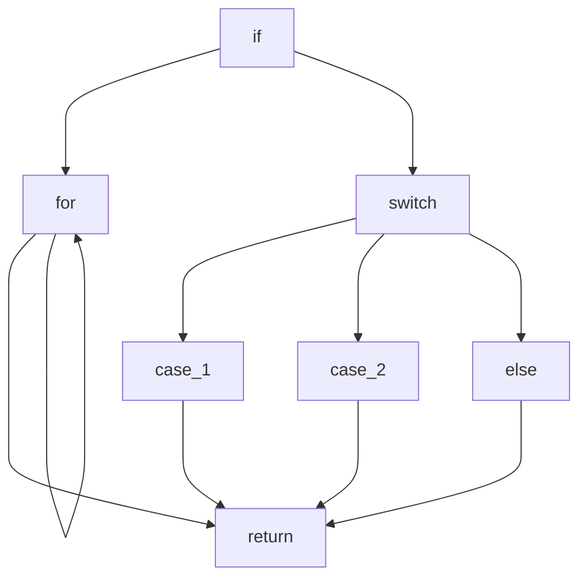

좋은 코드의 기준은 가독성, 유지보수성, 성능 등 다양하다. 따라서 좋은 코드의 정의는 개개인의 경험과 가치판단에 따라 다를 수 있으며, 이는 코드에 대한 서로의 의견에 충돌을 만들곤 한다.

좋은 코드를 위한 고민은 꾸준히 진행되어야 하지만, 이런 논쟁을 매 코드를 작성할 때 마다 진행하는 것은 피곤한 일이다. auto-linter, code-analyzer 들은 이런 부분을 자동화하여 해결한다. 명시적인 지표를 바탕으로 코드를 분석하여 좋은 코드에 대한 정확한 의사결정을 돕거나, 심지어 좋은 코드가 되도록 자동 수정해 주기도 한다.

따라서 좋은 코드의 특징을 수치화 하는 것은 꽤 중요한 일이라고 할 수 있으며, 오늘은 좋은 코드의 특징 중 하나인 `가독성` 을 수치화 하여 나타내는 [Cyclomatic Complexity](https://en.wikipedia.org/wiki/Cyclomatic_complexity), [Cognitive Complexity](https://www.sonarsource.com/docs/CognitiveComplexity.pdf) 를 살펴보려고 한다.

## 가독성의 정의?

가독성은 언어에 대한 숙련도에 따른 편차 등... 개개인의 편차가 발생하는 정량적인 지표이다. 그만큼 가독성을 측정하기 위한 절대적인 지표를 잡아내는 것은 아주 힘든 일이다. 하지만 잦은 개발을 통해 일반화 할 수 있는 가독성 저해 요소들을 알고 있다. 너무 깊은 callback | if 문, 수많은 goto 문과 같은 것들 말이다. 따라서 가독성을 지표화 한다는 것은 어느정도 일반화 할 수 있는 가독성 저해 사례들을 모아 귀납적으로 모델링 하는 것이라고 볼 수 있다.

Cyclomatic Complexity 와 Cognitive Complexitiy 는 **함수를 읽으면서 발생하는 논리적 분기점** 이 많을 수록 가독성을 헤친다, 라는 사례들을 바탕으로 만들어진 지표이다.

### Cyclomatic Complexity (McCabe, 1976)

함수를 읽을 때 시선은 자연스럽게 위에서 아래로 흘러가고, 이는 책을 읽는 것 처럼 자연스럽다.
```js
function 아침준비() {
  const (계란, 베이컨, 우유) = 냉장고.재료꺼내기()
  const 팬 = 팬_달구기()
  const 계란후라이 = 계란굽기(팬, 계란)
  const 구운베이컨 = 베이컨굽기(팬, 베이컨)
  식탁에올리기(우유, 계란후라이, 구운베이컨)
}
```

하지만 함수 안에서 if, while 과 같은 분기문이 발생하면 우리의 사고는 자연스러운 흐름을 벗어나 인지에 영향을 준다.

```js
function 아침준비() {
  var (계란, 베이컨, 우유) = 냉장고.재료꺼내기()
  if (계란 === null) {
    for (마트 in 주변상가) {
      if (마트.영업중인지_확인하기()) {
        계란 = 마트.계란사기()
        break
      }
    }
    if (계란 === null) {
      메추리알
    }
  }
  // ...
}
```

계란이 없으면 발생하는 일들을 if, while 문을 따라가며 눈이 상하좌우로 움직이며 이는 분기문 발생 이전의 맥락을 꾸준히 기억하면서, 분기문 발생 이후의 모든 경우의 수를 확인해야 하며, 결국 인지오류를 가져올 확률이 높다.

이런 함수를 통해서 발생할 수 있는 논리적 분기의 발생 횟수로 함수의 복잡도를 측정할 수 있는 지표가 Cyclomatic Complexitiy 이다.

수학적으로는 함수의 흐름을 순서도로 구성했을 때 `존재하는 간선의 수 - 존재하는 노드의 수 + 2` 로 정의할 수 있지만, 그냥 쉽게 말해서 함수에서 존재하는 if 문이나 while, switch(의 case) 문의 개수라고 볼 수 있다.

```js
function doSomething(flag, len) { // default (1)
  if (len !== 0) { // +1 (2)
    for (var i = 0; i < 10; i++) { // +1 (3)
      doOnIter()
    }
  } else {
    switch (flag) {
      case 1: doOn1() // +1 (4)
      case 2: doOn2() // +1 (5)
      default: doOnDefault()
    }
  }
  return
}
// total 5 complexity in doSomething
```


> 간선 - 노드 + 2 = 10 - 7 + 2 = 5

이렇게 우리는 코드의 복잡도를 수치화할 수 있게되었다! 이제 이를 바탕으로, 함수의 복잡도를 확인하고 적절하게 낮추는 등 다양한 행동을 할 수 있게 되었다.
하지만 위 정의는 가끔 우리의 직관과 반대되는 결과를 가져오기도 한다.

```js
function sumOfPrimes(max) { // +1
  var total = 0 
  for (var i = 1; i <= max; i++) { // +1
    for (var j = 2; j < i; j++) { // +1
      if (i % j === 0) { // +1
        continue
      }
    }
    total += i;
  }
  return total;
}
// total 4 complexity
```

```js
function getWords(number) { // +1
  switch (nubmer) {
    case 1: return "one" // +1
    case 2: return "two" // +1
    case 3: return "three" // +1
    default: return "lots" //
  }
}
// total 4 complexity
```

직관적으로도 `getWords` 의 복잡도가 `sumOfPrimes` 보다 훨씬 낮아보이지만, 실제로 complexity 는 차이가 없다.

또한 1976년과 다르게 현대의 언어는 일급객체 함수, null coalescing 등 다양한 방법을 통해 복잡도가 발생하거나 줄어드는 사례들이 추가되었다.

이런 nested 된 분기의 복잡도 증가나 현대적인 언어 기능등을 고려하여 개선한 함수 복잡도 계산 지표가 Cognitive Complexity 이다.

...계속


#### 참고한 글
- https://en.wikipedia.org/wiki/Cyclomatic_complexity


