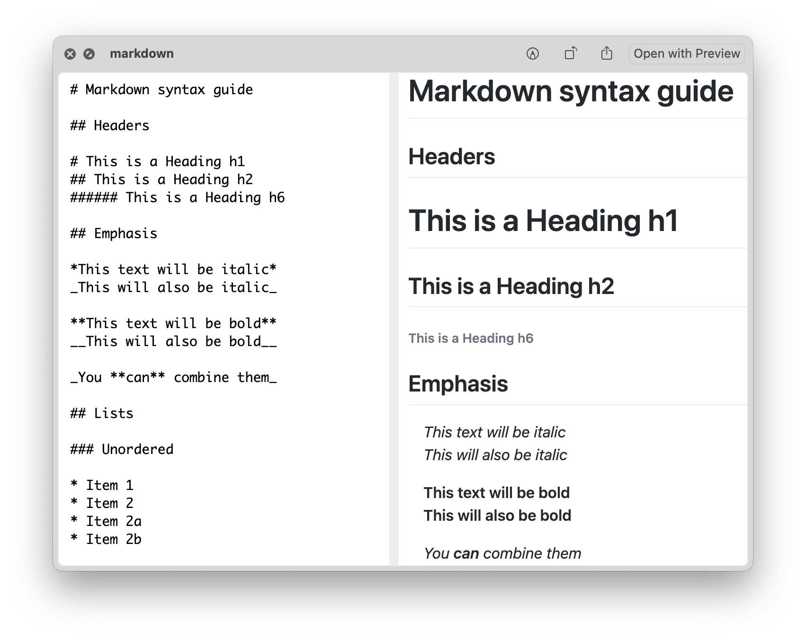
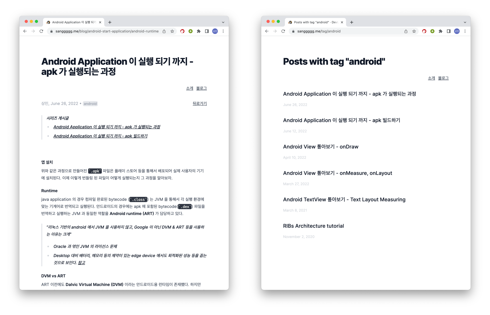

## 시작에 앞서

### 어쩌다 gatsbyjs 로 넘어갔는가..?

문서를 관리할 때 개인적으로 내용물을 구성하는 파일 포맷이 얼마나 범용성 있는가, 시각적/구조적으로 가공하기 쉬운 포맷을 지원하는가 (-> markup language)를 신경쓰는 편이다. 그 이유는 아래와 같다.

- 범용성 있는 포맷의 경우 문서 editor/viewer 플랫폼의 제약에 비교적 덜 묶여 마이그레이션에 용이하다.
- markup language 은 정보의 시각적 & 구조적 추가 가공을 위한 plugin 을 직접 만들기 용이하고, 포맷의 인지도가 높다면 그 생태계 또한 잘 갖춰져 있다.
  - _e.g. 코드 하이라이팅, 그래프 비주얼라이즈, 태그 정보 추출 및 그루핑 등_



markup language 의 일종인 [markdown](https://www.markdownguide.org/) 의 경우 나의 위와 같은 니즈를 아주 잘 만족시키는 포맷이였기에 markdown을 알게되고 나서는 거의 모든 문서를 markdown으로 작성해 왔다. 개인 노트 필기의 경우에도 [bear](https://bear.app/), [inkdrop](https://www.inkdrop.app/) 같은 markdown 문서 편집 기능이 잘 갖춰진 툴을 선호해 왔다.

> 이번 글에서 다룰 주제는 아니지만 inkdrop 의 경우 다양한 플러그인과 플러그인 생태계를 제공하고 있어서 현재 아주 유용하게 사용하고 있다. (무려 vim plugin 을 제공한다 ㅎㅎ)

그리고 이 포스팅의 주제가 될 블로그의 글 또한 markdown으로 작성해서 notion, jekyll, medium, next.js 같은 서비스/프레임워크를 통해 배포해 왔다.

하지만 앞서 말한 서비스를 사용하면서는 비교적 markdown을 통한 **정보의 시각적 & 구조적 추가 가공** 을 위한 플러그인 확장에 있어서 아쉬움을 많이 느꼈고, 결국 오늘 소개할 gatsbyjs 를 통해서 이 부분을 비교적 만족스럽게 해결할 수 있었다.

---

## GatsbyJs

### GatsbyJs 가 하는 일

> Gatsby is the fast and flexible framework that makes building websites with any CMS, API, or database fun again. https://www.gatsbyjs.com/

공식 설명 처럼 gatsby 는 [Content Management System (이하 CMS)](https://www.oracle.com/kr/content-management/what-is-cms/) 웹페이지를 구성에 유용한 프레임 워크이다.
CMS 의 경우 일반적으로 수많은 컨텐츠 데이터를 규격화된 형태로 가공하여 페이지 방문자에게 노출하고, 수정할 수 있게 도와주는 서비스를 말한다.

말이 길지만, 쇼핑몰 페이지 & 블로그 페이지 등에 적합한 서비스라고 가볍게 생각해도 될 것 같다. 그럼 어떤 점이 다른 CMS 에 비해서 강점으로 느껴졌을까? 우선 강점을 말하기 전에 gatsbyjs 가 static site 를 만드는 과정을 간단하게 설명하고 넘어가겠다.

### GatsbyJs 의 동작 과정

gatsby 의 일반적인(SSG 만을 고려한) 동작 원리는

1. 파일시스템, DB, 외부 API 등에서 컨텐츠를 구성하기 위한 Raw Data (이하 node) 를 뽑아낸다. _markdown 파일, 이미지 파일 등이 이런 node 라고 볼 수 있다._
2. 뽑아낸 node 들은 [graphQL](https://graphql.org/) 스키마의 형태로 조회 가능하도록 모아둔다.
3. graphQL 에 node 의 구성이 완료되었다면, gatsby 는 이렇게 구성된 graphQL 스키마를 쿼리하여 알맞은 page 결과물 (`html`, `css`, `js`) 을 생성한다.

### GatsbyJs 의 plugin

이때 gatsbyjs 의 강력한 점은 1, 2, 3 과정에서

- 새로운 node 를 가져오는 정보의 원천을 정의하거나
- node 가 추가될 때, page 가 추가될 때 등의 이벤트가 발생할 때 노드를 추가적으로 가공하는
  plugin 을 추가할 수 있다는 점이다.

예를 들자면 아래와 같은 플러그인 들이 존재한다.

- [gatsby-source-filesystem](https://www.gatsbyjs.com/plugins/gatsby-source-filesystem/) 이라는 플러그인은 현재 런타임에 존재하는 디렉토리를 node 를 생성하는 소스로 사용할 수 있다.
- [gatsby-transformer-remark](https://www.gatsbyjs.com/plugins/gatsby-transformer-remark/) 라는 플러그인은 새로 추가된 node 의 mediaType 이 markdown 일 경우 내용물을 markdown 파서로 파싱해 가공한 형태의 node 로 변형시킨다.
- [gatsby-plugin-sharp](https://www.gatsbyjs.com/plugins/gatsby-plugin-sharp) 라는 플러그인은 image 파일 노드에 웹 이미지 서빙을 위한 최적화를 진행해 준다.

덕분에 지금 구성한 이 블로그에서도 번잡한 코드 없이 간단하게 image 를 추가하거나, code highlight 를 넣거나, markdown 파일을 기능을 외부 라이브러리 플러그인으로 쉽게 추가할 수 있었다.

> 심지어 theme 자체도 손쉽게 가져올 수 있었으나, 맘에 드는 theme 을 찾지 못하여 직접 [nextra-theme-blog](https://github.com/shuding/nextra/tree/core/packages/nextra-theme-blog) 를 카피하여 제작하였다.

또한 꼭 외부 라이브러리 플러그인이 아니더라도 내가 블로그 재기획 시 고려한

- 같은 path 를 공유하는 파일을 query 해서 동일한 시리즈 게시글로 묶어서 노출 하거나
- 같은 tag 를 공유하는 파일을 한번에 검색하는 페이지를 만드는 기능

등을 쉽게 추가할 수 있었다.


_글 작성일 기준 개발 블로그의 모습_

이처럼 gatsby node 의 생성을 직접 컨트롤 하고 graphQL 로 저장하면서 컨텐츠 추가 가공에 있어서 강력한 확장성을 가질 수 있었다.

### GatsbyJs 의 Page Generate

GatsbyJs 의 다른 강점 중 하나는 graphQL 과 React 를 기반으로 페이지 생성 시 그 template 이 되는 코드를 간단하게 작성할 수 있다는 점이었다.

페이지 생성의 경우 다양한 방법이 있지만, 우선 내가 선택한 방법은 Page 에서 필요로 하는 정보를 query 로 정의하고, 그 query 를 props 로 받아서 렌더링을 진행하는 React Component 를 추가하는 방식으로 진행했다.

```ts
allPosts.forEach((node) => {
  if (!(node.fields?.slug && node.fields?.series)) return;
  console.log(`Create Page ${node.fields.slug}`);
  createPage({
    path: node.fields.slug,
    component: `${__dirname}/src/templates/post.tsx`,
    context: { slug: node.fields.slug, series: node.fields.series },
  });
});
// page generation 예시
// https://github.com/sanggggg/me-src/blob/main/gatsby-node.ts
```

Gatsby 처럼 node 와 page 라는 백엔드와 프론트엔드를 분리 시키는 접근은 자칫 둘 사이의 인터페이스 정의에 불필요한 리소스를 써야하는 결과로 이어질 수 있는데, gatsby 는 graphQL 을 도입하여 이런 문제들을 최대한 간편하게 풀 수 있도록 도와주었다.

```ts
export const query = graphql`
  query BlogList {
    allMdx(sort: { fields: frontmatter___date, order: DESC }) {
      nodes {
        frontmatter {
          date(formatString: "MMMM D, YYYY")
          title
        }
        fields {
          slug
        }
        id
      }
    }
  }
`;
// 앞서 generate 되는 페이지의 graphQL 쿼리 예시
// https://github.com/sanggggg/me-src/blob/main/src/pages/blog/index.tsx
```

또한 리액트를 통한 컴포넌트 구성은 이미 나에게 매우 익숙하고 대중화된 (~= 검증된) 기술이었고, 심지어 [graphQL schema 에 대한 typing](https://www.gatsbyjs.com/blog/how-to-use-gatsby-graphql-type-generation/) 까지 지원해 주어서 typescript + react 라는 안락한 조합으로 개발을 진행할 수 있었다.

```ts
const BlogList: React.FC<PageProps<Queries.BlogListQuery>> = ({ data }) => {
  return (
    <Layout pageTitle="개발">
      <ul>
        {data.allMdx.nodes.map((node) => (
          <div className="post-item" key={node.id}>
            <h3>
              <Link to={`${node?.fields?.slug}`} className="post-item-title">
                {node?.frontmatter?.title}
              </Link>
            </h3>
            <time className="post-item-date">{node?.frontmatter?.date}</time>
          </div>
        ))}
      </ul>
    </Layout>
  );
};
// 앞서 generate 되는 페이지의 React Component 예시
// https://github.com/sanggggg/me-src/blob/main/src/pages/blog/index.tsx
```

> GraphQL Schema 에 대한 타이핑이 진짜... 개발에 엄청 효과가 좋았다.
> 최초에 간단한 사이트를 만들 때 typescript & typegen 을 안 넣고 있다가 PageContext 의 field 들을 실수로 잘못 적어서 디버깅에 한참 고생했는데,
> 실제 블로그 제작 시 typegen 을 도입하며 이런 문제 들이 싹 사라졌다.

## 마무리

기존 다른 플랫폼에서 작성/배포하던 블로그를 gatsbyjs 로 이전한 과정과 이전의 이유를 gatsby 의 장점과 함께 살펴보았다.
우선 frontend (page) & backend (node) 의 분리로 인한 plugin 확장이 편리한 점이 내 마음에 들었고
또 graphQL 을 사용하여 front & back 간의 인터페이스를 편리하게 정의할 수 있는 점도 아주 마음에 들었다.

위의 장점들의 도움으로 앞으로는 tag 나 series 등의 기획을 추가한 것 처럼, H 태그에 직접 앵커 링크를 건다 던지... 등등 추가적인 기획 들을 개발/적용해 보려고 한다.

## 참고한 글

- [Tutorial: Learn how Gatsby works](https://www.gatsbyjs.com/docs/tutorial/)
