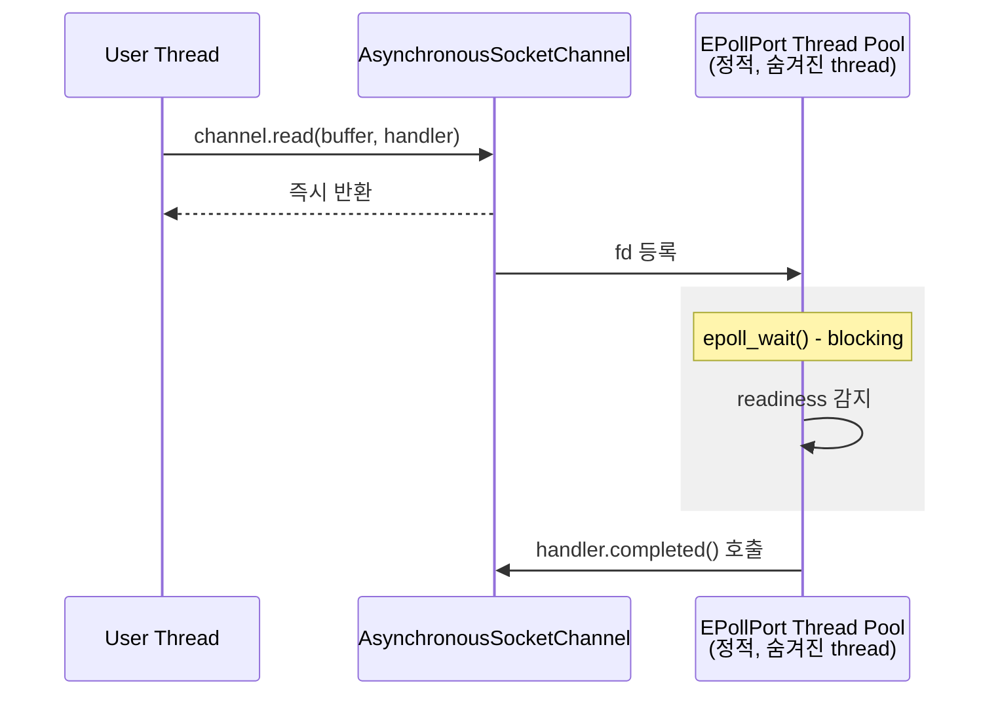
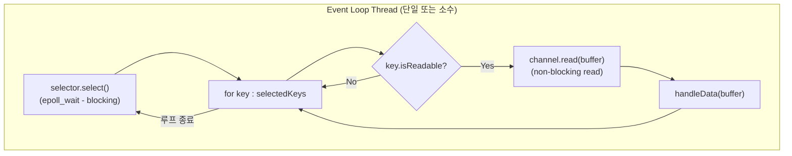

file, network 등의 I/O 처리를 할 때는 외부 응답에 의존하는 만큼 I/O 작업은 빠르거나 예측가능한 응답속도를 보장할 수 없다.

따라서 이런 API 처리는 필연적으로 non-blocking, asynchronous 등의 키워드와 연결된다.

### 용어 정의

이 글에서 사용하는 용어를 먼저 정리하고 가자. (참고: [Asynchronous vs Non-blocking](https://stackoverflow.com/questions/2625493/asynchronous-and-non-blocking-calls-also-between-blocking-and-synchronous))

**Blocking / Non-blocking**: 호출한 thread가 작업 완료까지 대기하는가?
- **Blocking**: 작업이 완료될 때까지 호출 thread가 멈춤
- **Non-blocking**: 호출 thread가 즉시 반환됨 (작업 완료 여부와 무관하게)

**Synchronous / Asynchronous**: 작업 완료를 어떻게 알 수 있는가?
- **Synchronous**: 함수 반환 시점에 결과를 알 수 있음 (blocking이든 non-blocking이든)
- **Asynchronous**: 작업 완료 시 별도 메커니즘(callback, event 등)으로 통보받음

이 구분이 중요한 이유는, 예를 들어 socket에 `O_NONBLOCK`을 설정하면 read가 즉시 반환되지만(non-blocking), 데이터가 언제 도착했는지 알려주는 메커니즘은 없다(not asynchronous). 완료 통보를 받으려면 `epoll` 같은 별도 메커니즘이 필요하다.

### Java NIO vs NIO.2

Java에서는 이 두 개념이 다른 API로 제공된다:

| | **NIO (Java 1.4)** | **NIO.2 (Java 7)** |
|---|---|---|
| 핵심 클래스 | `Selector` + `SocketChannel` | `AsynchronousSocketChannel` |
| 방식 | Non-blocking + I/O Multiplexing | Asynchronous (callback/Future) |
| File I/O | `FileChannel` (blocking only) | `AsynchronousFileChannel` |
| 사용 예 | Netty, Vert.x | 일부 내장 서버 |

이 글에서는 **NIO.2의 Asynchronous API** (`AsynchronousFileChannel`, `AsynchronousSocketChannel`)를 분석한다. Netty나 Spring WebFlux가 사용하는 **Selector 기반 NIO는 다른 메커니즘**이며, 글 후반부에서 간략히 비교한다.

주변 Spring 개발자들과 이야기 하다 보면 DB I/O 시에 [jdbc] vs [r2dbc] 와 같이 blocking io 와 non-blocking io 를 비교하며 [Spring Webflux] 와 같이 limited thread 가 사용되어야 하는 환경에서는 non-blocking io 를 사용하라고들 한다.

blocking io 는 동시에 많은 i/o 처리를 위해서는 여러개의 thread 를 만들어야 하기 때문에 그렇다고 카더라. 물론 Webflux 뿐 아니라, thread 를 많이 생성하는 오버헤드가 부담스러운 모든 상황에 적용될 수 있는 말이다.

음... 그렇다면 jvm 에서는 어떻게 추가적인 thread 를 사용하지 않고 (_스포일러: 또는 감추고_) non-blocking asynchronous i/o 를 할 수 있는 것일까?

```java
someIOTask(new IOCallback() {
  @Override
  public void onSuccess() {
    System.out.println("Success!");
  }
);
// 누가 네트워크 요청을 수행하고, 그 결과가 완료되기를 감지하고, 완료되었다면 onSuccess 와 같은 callback 을 수행하는 걸까?
```

고민의 시작처럼 jdbc 와 r2dbc 를 비교하면 좋겠지만 보다 간단한 구현체이면서 I/O 에 대해서 각각 blocking, non-blocking api 를 제공하는 [java.io] 패키지와 [java.nio] 의 패키지를 비교해 보는 글을 작성하려고 한다.

글의 흐름은

- jvm 에서 thread non-blocking & asynchronous io 하려면 어떤 구현이 필요할지 사고 과정을 이야기 하고
- 실제 [openjdk8] 의 구현체를 뜯어 보면서 이를 확인해보려고 한다.

> java thread 는 구현에 따라 다를 수 있지만 일반적으로 jvm 실행 환경의 kernel thread 와 1:1 대응된다.
> 따라서 요번 글에서는 kernel thread 와 java thread 가 1:1 바인딩되는 **[openjdk8] 의 linux(unix) 구현이나 linux syscall 을 기준으로 작성되었다는 점** 을 참고해 주셨으면 한다.
> java thread 와 kernel thread 가 1:1 바인딩되므로 이후 글에서 이야기 하는 thread 는 둘 다에 대응된다고 보시면 된다.

## 생각의 흐름

kernel thread 의 블로킹을 막으려면 실제 i/o 를 위해 내부적으로 실행하는 read syscall 이 non-blocking 이어야 한다

그런데... read syscall 이 thread non-blocking 이라는게 어떤 이야기 일까? read syscall 같은 저수준 인터페이스에서 콜백 람다같은 걸 넘겨주고 이걸 read 끝나면 실행하게 시키는 것도 아닐테고 흠... (그리고 그렇다면 그 콜백을 실행하는 주체도 잘 모르겠고)

애초에 read syscall 이 non-blocking 하게 실행될 수 있는걸까?

linux man page 의 [read](https://man7.org/linux/man-pages/man2/read.2.html), [open](https://man7.org/linux/man-pages/man2/open.2.html) 등의 I/O syscall 들을 뜯어본 결과 알아낸 사실은 아래와 같다.

>      O_NONBLOCK or O_NDELAY
>             When possible, the file is opened in nonblocking mode.
>             Neither the open() nor any subsequent I/O operations on
>             the file descriptor which is returned will cause the
>             calling process to wait.
>
> https://man7.org/linux/man-pages/man2/open.2.html

>      EAGAIN The file descriptor fd refers to a file other than a
>             socket and has been marked nonblocking (O_NONBLOCK), and
>             the read would block.  See open(2) for further details on
>             the O_NONBLOCK flag.
>
> https://man7.org/linux/man-pages/man2/read.2.html

위 EAGAIN 인용은 pipe 나 FIFO 같은 특수 파일에 해당하는 내용이다. regular file 의 경우는 아래 인용처럼 O_NONBLOCK 이 의미가 없다.

>      Note that this flag has no effect for regular files and block
>             devices
>
> https://man7.org/linux/man-pages/man2/open.2.html

regular file 에 대한 read 는 disk I/O 가 필요하며, 이는 항상 block 된다. (단, Linux 5.1+ 에서 도입된 [io_uring](https://man7.org/linux/man-pages/man7/io_uring.7.html) 을 사용하면 진정한 async file I/O 가 가능하지만, 이 글에서 다루는 OpenJDK 8 에서는 사용되지 않는다.)

#### 요약

- regular file 에 대한 I/O 는 O_NONBLOCK 을 설정해도 thread blocking 될 수 밖에 없다. (disk I/O 는 항상 blocking)
- socket file 에 대한 I/O 는 O_NONBLOCK flag 를 주어서 연 socket 이라면 thread-non-blocking 하다.
  - 즉 read 를 호출할 때 커널의 receive buffer 에 데이터가 있으면 즉시 반환하고, 없으면 block 하지 않고 `EAGAIN` 을 반환한다. 하지만 데이터가 도착했는지를 알려주는 별도의 메커니즘은 없다; non-blocking but not asynchronous
  - 데이터 도착 여부를 알기 위해서는 [select](https://man7.org/linux/man-pages/man2/select.2.html), [poll](https://man7.org/linux/man-pages/man2/poll.2.html), [epoll](https://man7.org/linux/man-pages/man7/epoll.7.html) 등의 I/O multiplexing 메커니즘이 필요하다.

linux는 왜 이렇게 구현되어 있어? 는 또 다른 질문이니 여기서 일단 그렇구나~ 하고 넘어갔다.
그렇다면 이제 두 경우를 쪼개어 생각하자.

1. regular file 에 대한 asynchronous api 를 제공하는 `AsynchronousFileChannel` 은 도대체 어떻게 구현되어있길래 syscall 도 못하는 asynchronous 를 제공하는 걸까?
2. socket 에 대한 asynchronous 인터페이스 `AsynchronousSocketChannel` 은 내부적으로 non-blocking socket + 완료 통보 메커니즘을 조합해서 구현되어 있을 것이다. 그렇다면 그 완료 통보는 어떻게 구현되어 있을까?

### 1. Regular file 에 대한 asynchronous I/O

사실상 linux 의 syscall read 가 제공하지 못하는 기능을 java 에서 제공할 리가 없다. 그렇다면 jvm runtime 이 정적이고 전역적인 file I/O 를 처리하는 쓰레드 풀을 이미 가지고 있지만 jvm 사용자에게는 감추고 있어서 사용자에게는 마치 asynchronous I/O 인 양 처리되지 않을까?

### 2. Socket 에 대한 asynchronous I/O

socket은 `O_NONBLOCK`으로 non-blocking read가 가능하지만, 데이터 도착을 감지하려면 `epoll` 같은 I/O multiplexing이 필요하다. 그렇다면 `AsynchronousSocketChannel`은 내부적으로 epoll을 호출하는 별도의 thread를 가지고 있지 않을까?

이제 위 생각을 코드를 통해 검증해보자. 각각을 위한 검증은 java.nio 의 [AsynchronousFileChannel] 과 [AsynchronousSocketChannel] 구현체들을 뜯어보며 진행된다.

> 참고로 java.nio 의 `n` 은 non-blocking 이 아니라 `new` io 다.
> NIO 패키지는 non-blocking I/O (Selector 기반), asynchronous I/O (NIO.2), direct buffer 등 다양한 최적화를 제공한다. File I/O 도 `AsynchronousFileChannel` 외에 동기식 `FileChannel` 도 존재한다. [참고](https://homoefficio.github.io/2016/08/06/Java-NIO%EB%8A%94-%EC%83%9D%EA%B0%81%EB%A7%8C%ED%81%BC-non-blocking-%ED%95%98%EC%A7%80-%EC%95%8A%EB%8B%A4/)

> Socket I/O 는 `SocketChannel` + `Selector` 조합 (NIO) 또는 `AsynchronousSocketChannel` (NIO.2) 두 가지 방식이 있다. 이 글에서는 file I/O 와의 비교를 위해 후자를 분석한다. Selector 기반 방식은 글 후반부에서 다룬다.

## 코드 뜯어보기

### [AsynchronousFileChannel]

우리가 확인해야할 method 는 I/O read API 들이다.

```java
// AsynchronousFileChannel.java
    public abstract <A> void read(ByteBuffer dst,
                                  long position,
                                  A attachment,
                                  CompletionHandler<Integer,? super A> handler);
```

CompletionHandler 가 Callback argument 로 사용자에게 제공되는 모습을 볼 수 있다.
이제 이 CompletionHandler 가 어느 곳에서 호출되는가를 눈여겨 보면서 코드를 따라가 보자.

위 abstract method 의 linux 구현체를 찾아보면 실제 `handler` 가 호출되는 코드는 `SimpleAsynchronousFileChannelImpl` 에서 찾아볼 수 있다.

```java
// SimpleAsynchronousFileChannel.java
    <A> Future<Integer> implRead(final ByteBuffer dst,
                                 final long position,
                                 final A attachment,
                                 final CompletionHandler<Integer,? super A> handler)
    {
        // ...생략
        Runnable task = new Runnable() {
            public void run() {
                int n = 0;
                Throwable exc = null;

                int ti = threads.add();
                try {
                    begin();
                    do {
                        n = IOUtil.read(fdObj, dst, position, nd); // 1. read syscall 을 때린다.
                    } while ((n == IOStatus.INTERRUPTED) && isOpen());
                    if (n < 0 && !isOpen())
                        throw new AsynchronousCloseException();
                } catch (IOException x) {
                    if (!isOpen())
                        x = new AsynchronousCloseException();
                    exc = x;
                } finally {
                    end();
                    threads.remove(ti);
                }
                if (handler == null) {
                    result.setResult(n, exc);
                } else {
                    Invoker.invokeUnchecked(handler, attachment, n, exc);
                }
            }
        };
        executor.execute(task); // 2. 위 read 하는 동작을 다른 executor 에서 실행시킨다.
        return result;
    }
```

```c
// UnixFileDispatcherImpl.c
// IOUtil.read 를 잘 따라가다 보면 아래 코드가 실행되는 것을 확인할 수 있다.
JNIEXPORT jlong JNICALL
Java_sun_nio_ch_UnixFileDispatcherImpl_readv0(JNIEnv *env, jclass clazz,
                              jobject fdo, jlong address, jint len)
{
    jint fd = fdval(env, fdo);
    struct iovec *iov = (struct iovec *)jlong_to_ptr(address);
    return convertLongReturnVal(env, readv(fd, iov, len), JNI_TRUE); // 여기 이 readv 가 syscall 이다
}
```

1. read syscall 를 수행하는 blocking Runnable Task 를 만들고
2. 이 task 를 executor (thread pool) 에 넘겨주어 대신 blocking task 를 실행하는 것을 확인할 수 있다.
   (`executor.execute(task)`)
   그렇다면 이 executor 는 어디서 나온 것일까?

```java
// SimpleAsynchronousFileChannel.java
public class SimpleAsynchronousFileChannelImpl
    extends AsynchronousFileChannelImpl
{
    // lazy initialization of default thread pool for file I/O
    private static class DefaultExecutorHolder {
        static final ExecutorService defaultExecutor =
            ThreadPool.createDefault().executor();
    }
    // 생략...
}
```

놀랍게도 jvm 에서 SimpleAsynchronousFileChannelImpl 이 static 하게 가지고 있는 Thread Pool 이다.
따라서 **`AsynchronousFileChannel`의 asynchronous I/O 는 JVM 내부의 정적 thread pool 이 blocking I/O 를 대신 수행하는 방식**으로 구현되어 있다는 사실을 확인할 수 있었다.

> 참고: 이 thread pool 은 `AsynchronousChannelGroup`을 통해 사용자가 직접 지정할 수도 있다. 위 코드의 `DefaultExecutorHolder`는 사용자가 별도로 지정하지 않았을 때 사용되는 기본값이다.

### [AsynchronousSocketChannel]

이제 socket I/O 의 read 가 어떻게 실행되는지 살펴보자.

```java
// AsynchronousSocketChannel.java

    public abstract <A> void read(ByteBuffer dst,
                                  long timeout,
                                  TimeUnit unit,
                                  A attachment,
                                  CompletionHandler<Integer,? super A> handler);
```

file io 와 유사한 `CompletionHandler` 를 콜백으로 삼고 있으므로, 마찬가지로 이 `handler` 를 호출하는 linux 구현체를 따라가 보면 `UnixAsynchronousSocketChannelImpl` 를 확인할 수 있다.

일단, 앞서 확인한 O_NONBLOCK 을 세팅하는 코드 부터 확인할 수 있다.

```java
// UnixAsynchronousSocketChannelImpl.java
    UnixAsynchronousSocketChannelImpl(Port port)
        throws IOException
    {
        super(port);

        // set non-blocking
        try {
            IOUtil.configureBlocking(fd, false);
        } catch (IOException x) {
            nd.close(fd);
            throw x;
        }

        this.port = port;
        this.fdVal = IOUtil.fdVal(fd);

        // add mapping from file descriptor to this channel
        port.register(fdVal, this);
    }
```

```c
// IOUtil.c
static int
configureBlocking(int fd, jboolean blocking)
{
    int flags = fcntl(fd, F_GETFL);
    int newflags = blocking ? (flags & ~O_NONBLOCK) : (flags | O_NONBLOCK);

    return (flags == newflags) ? 0 : fcntl(fd, F_SETFL, newflags);
}
```

그리고 handler 를 넘겨받는 read 함수는 아래와 같다

```java
// UnixAsynchronousSocketChannelImpl.java
    @Override
    @SuppressWarnings("unchecked")
    <V extends Number,A> Future<V> implRead(boolean isScatteringRead,
                                            ByteBuffer dst,
                                            ByteBuffer[] dsts,
                                            long timeout,
                                            TimeUnit unit,
                                            A attachment,
                                            CompletionHandler<V,? super A> handler)
    {
        // ...생략
        Throwable exc = null;

        try {
            begin();

            if (attemptRead) {
                if (isScatteringRead) {
                    n = (int)IOUtil.read(fd, dsts, true, nd); // 여기서 read syscall 을 호출한다.
                } else {
                    n = IOUtil.read(fd, dst, -1, true, nd);

            }

            // ...생략
                    this.readHandler = (CompletionHandler<Number,Object>)handler; // 음? 그런데 handler 를 자신의 필드로 저장한다?
                 updateEvents()
            // ...생략
        }
    }


// ...생략

    private void finishRead(boolean mayInvokeDirect) {
        // ...생략

        CompletionHandler<Number,Object> handler = readHandler;

        // ...생략

        // invoke handler or set result
        if (handler == null) {
            future.setResult(result, exc);
        } else {
            if (mayInvokeDirect) {
                Invoker.invokeUnchecked(handler, att, result, exc);
            } else {
                Invoker.invokeIndirectly(this, handler, att, result, exc);
            }
        }
    }

```

너무 길어서 핵심적인 코드만 남겼는데 결국 `UnixAsynchronousSocketChannelImpl` 는

1. O_NONBLOCK 을 세팅한다.
2. read 함수에서는 우선 non-blocking read 를 호출한다.
3. 자신의 필드 변수로 handler 를 넘겨주고
4. updateEvents 라는 함수를 실행시킨다?
5. 그리고 `UnixAsynchronousSocketChannelImpl` 이 구현하고 있는 `Port.Pollable` 이라는 인터페이스의 `onEvent` 함수 구현에서 호출되는 finishRead 에서 이 handler 를 실행한다.

와 같은 역할을 수행하고 있다. 여기서 이 updateEvents 는

```java
    private void updateEvents() {
        // ...생략
            port.startPoll(fdVal, events);
```

file descriptor 를 가지고 `startPoll` 을 하는 것을 확인할 수 있다
여기서 poll 은 내가 아는 thread blocking poll (linux 의 [epoll](https://man7.org/linux/man-pages/man7/epoll.7.html) 같은) 을 말하는 것 같은데...

실제 코드를 따라가다 보면 어느 구현체에서 결국 저 함수는

```c
JNIEXPORT jint JNICALL
Java_sun_nio_ch_EPoll_wait(JNIEnv *env, jclass clazz, jint epfd,
                           jlong address, jint numfds, jint timeout)
{
    struct epoll_event *events = jlong_to_ptr(address);
    int res = epoll_wait(epfd, events, numfds, timeout);
    if (res < 0) {
        if (errno == EINTR) {
            return IOS_INTERRUPTED;
        } else {
            JNU_ThrowIOExceptionWithLastError(env, "epoll_wait failed");
            return IOS_THROWN;
        }
    }
    return res;
}
```

위와 같은 epoll_wait 라는 blocking syscall 을 호출한다는 것을 알 수 있다.
그리고 그 실행 주체 쓰레드를 가지는 EPollPort.java 라는 객체는

```java
// LinuxAsynchronousChannelProvider.java
public class LinuxAsynchronousChannelProvider
    extends AsynchronousChannelProvider
{
    private static volatile EPollPort defaultPort
    // 생략...
}
```

정적인 형태로 jvm runtime 에 존재하는 모습을 확인할 수 있다.

Socket 쪽 코드는 그 깊이가 깊어서 글로 잘 담을 수 없었는데 정리하자면

1. O_NONBLOCK 을 세팅한다.
2. read 함수에서는 우선 non-blocking read 를 호출한다.
3. 그리고 이 socket 에 대한 I/O readiness (데이터가 도착하여 읽을 준비가 되었는지) 를 감지하는 역할을 `EPollPort` 라는 구현체에게 맡긴다.
4. `EPollPort` 는 정적인 객체로, 마찬가지로 정적인 thread pool 을 가지고 있다.
5. `EPollPort` 가 가지는 이 정적인 thread 에서 `epoll_wait` 를 호출하여 여러 socket 의 readiness 를 감시하고 있으며
6. 데이터가 도착하여 읽을 준비가 되면 이 사실을 SocketChannel 에게 전달하여 handler 실행을 완료한다

와 같다.

## 번외: Selector 기반 NIO는 어떻게 다른가?

앞서 분석한 `AsynchronousSocketChannel`은 NIO.2 API이다. 그런데 Netty, Vert.x, Spring WebFlux(reactor-netty) 등 고성능 네트워크 프레임워크들은 NIO.2가 아닌 **Selector 기반 NIO**를 사용한다.

두 방식의 차이를 간략히 비교해보자.

### NIO.2 (`AsynchronousSocketChannel`)



- callback 기반 API
- 내부적으로 `epoll_wait`를 호출하는 별도의 thread pool 존재
- 사용자가 thread를 직접 관리하지 않음

### NIO (`SocketChannel` + `Selector`) - Reactor Pattern



- event loop 기반 API
- **단일 thread가 `Selector`를 통해 수천 개의 connection을 관리**
- 숨겨진 thread pool 없음 - 사용자가 event loop를 직접 제어
- `epoll_wait`도 event loop thread에서 직접 호출

### 핵심 차이점

| | NIO.2 (Async) | NIO (Selector) |
|---|---|---|
| Thread 모델 | 숨겨진 thread pool | 명시적 event loop |
| I/O 수행 주체 | 내부 thread | event loop thread |
| 제어권 | 프레임워크 | 사용자 |
| 대표 사용처 | 일부 내장 서버 | Netty, Vert.x, WebFlux |

Netty 등이 NIO.2 대신 Selector 기반 NIO를 선택한 이유는:
1. **더 적은 thread 사용**: 숨겨진 thread pool 없이 소수의 event loop thread로 수만 개 연결 처리 가능
2. **세밀한 제어**: thread 모델, buffer 관리 등을 직접 최적화 가능
3. **예측 가능한 성능**: thread pool의 동작에 의존하지 않음

> 참고: [Netty의 NIO 구현](https://github.com/netty/netty/tree/4.1/transport/src/main/java/io/netty/channel/nio), [Scalable IO in Java - Doug Lea](http://gee.cs.oswego.edu/dl/cpjslides/nio.pdf)

## 정리

이 글에서는 JVM의 **NIO.2 Asynchronous API** (`AsynchronousFileChannel`, `AsynchronousSocketChannel`)가 내부적으로 어떻게 구현되어 있는지 분석했다.

**결론:**
- `AsynchronousFileChannel`: 정적 thread pool에서 blocking read를 수행하여 asynchronous API 제공
- `AsynchronousSocketChannel`: 정적 thread pool에서 `epoll_wait`로 readiness를 감시하여 asynchronous API 제공

두 경우 모두 **내부적으로 별도의 thread(pool)가 blocking 작업을 수행**하고 있었다. (OpenJDK 8, Linux 기준)

단, 이는 NIO.2 Asynchronous API에 한정된 이야기이며, Netty 등이 사용하는 **Selector 기반 NIO는 다른 방식**으로 동작한다. Selector 방식은 숨겨진 thread pool 없이 event loop에서 직접 I/O multiplexing을 수행한다.

#### 참고한 글

- https://homoefficio.github.io/2016/08/06/Java-NIO%EB%8A%94-%EC%83%9D%EA%B0%81%EB%A7%8C%ED%81%BC-non-blocking-%ED%95%98%EC%A7%80-%EC%95%8A%EB%8B%A4/
- http://eincs.com/2009/08/java-nio-bytebuffer-channel-file/
- https://jongmin92.github.io/2019/03/03/Java/java-nio/

#### Java NIO/NIO.2 공식 문서

- [Java NIO Tutorial - Oracle](https://docs.oracle.com/javase/tutorial/essential/io/fileio.html)
- [AsynchronousChannelGroup - JavaDoc](https://docs.oracle.com/javase/8/docs/api/java/nio/channels/AsynchronousChannelGroup.html) - 사용자 정의 thread pool 설정
- [Selector - JavaDoc](https://docs.oracle.com/javase/8/docs/api/java/nio/channels/Selector.html)

#### Reactor Pattern & 고성능 서버

- [Scalable IO in Java - Doug Lea](http://gee.cs.oswego.edu/dl/cpjslides/nio.pdf) - Reactor Pattern의 고전적 설명
- [Netty NIO 구현](https://github.com/netty/netty/tree/4.1/transport/src/main/java/io/netty/channel/nio)
- [The C10K problem](http://www.kegel.com/c10k.html) - I/O multiplexing 전략들에 대한 고전적인 문서

#### Linux I/O 관련 참고 자료

- [open(2) - Linux manual page](https://man7.org/linux/man-pages/man2/open.2.html) - O_NONBLOCK 플래그 설명
- [read(2) - Linux manual page](https://man7.org/linux/man-pages/man2/read.2.html) - read syscall 및 EAGAIN 에러
- [epoll(7) - Linux manual page](https://man7.org/linux/man-pages/man7/epoll.7.html) - epoll I/O event notification facility
- [io_uring(7) - Linux manual page](https://man7.org/linux/man-pages/man7/io_uring.7.html) - Linux 5.1+ 의 진정한 async file I/O

[jdbc]: https://ko.wikipedia.org/wiki/JDBC
[r2dbc]: https://spring.io/projects/spring-data-r2dbc
[java.io]: https://docs.oracle.com/javase/7/docs/api/java/io/package-summary.html
[java.nio]: https://docs.oracle.com/javase/8/docs/api/java/nio/package-summary.html
[spring webflux]: https://docs.spring.io/spring-framework/docs/current/reference/html/web-reactive.html
[openjdk8]: https://github.com/openjdk/jdk
[asynchronousfilechannel]: https://github.com/openjdk/jdk/blob/master/src/java.base/share/classes/java/nio/channels/AsynchronousFileChannel.java
[asynchronoussocketchannel]: https://github.com/openjdk/jdk/blob/master/src/java.base/share/classes/java/nio/channels/AsynchronousSocketChannel.java
