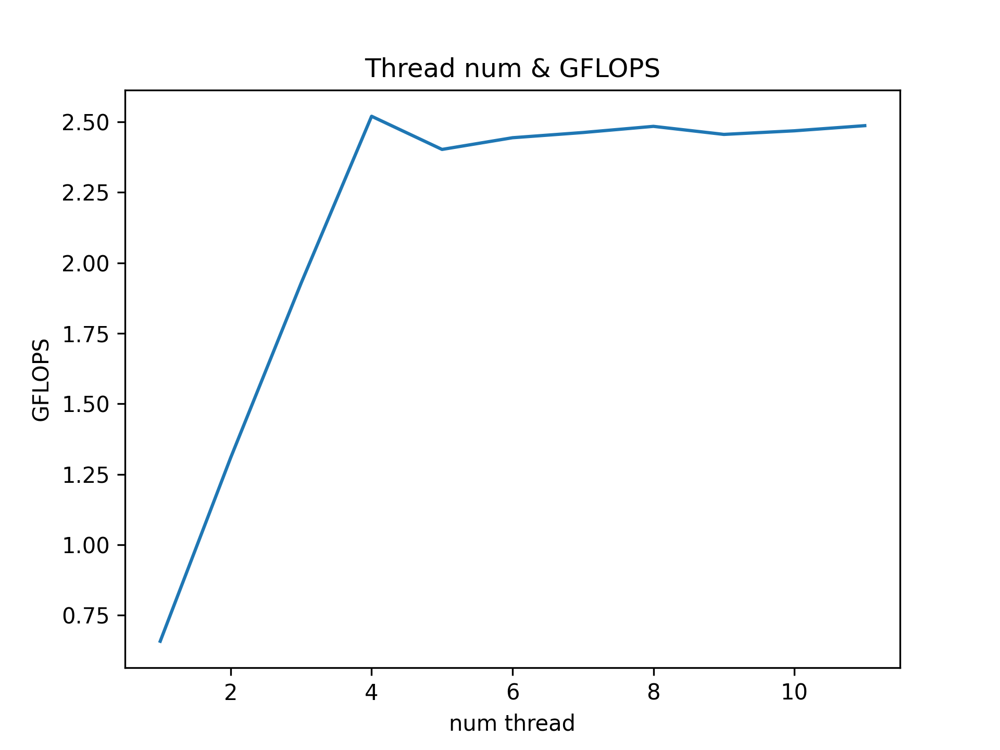

# Matrix Mutiplication speed up (2) - pthread를 통한 speed up

## pthread를 통한 speed up
이번 포스팅에서는 싱글코어가 아닌 여러개의 코어를 활용할 수 있도록 c의 pthread library를 사용해 speed up을 진행해 보겠습니다. 포스팅에서 사용한 코드는 [Github Repository](https://github.com/sanggggg/MatMulSpeedUp)에서 보실 수 있습니다. Performance 측정을 위해 다양한 option을 실행시에 줄 수 있도록 하였으니 참고하셔도 좋을 것 같습니다.

## pthread?
pthread 는 POSIX-thread의 줄임말으로, linux와 같은 unix 계열의 os에서 지원하는 threading interface입니다(window 도 지원됩니다). multi threading을 통해 여러개의 코어를 병렬적으로 사용하여 speed up을 적용해 보겠다.

### pthread api [(link)](https://docs.oracle.com/cd/E26502_01/html/E35303/tlib-1.html)
- 이번 포스팅에서 사용하는 api는 다음과 같습니다.
- `int pthread_create(pthread_t *thread, const pthread_attr_t *attr, void *(*start_routine)(void*), void *arg);`
  - 할당된 pthread 객체 `thread` 가 `start_routine` 을 실행하고 종료하도록 만든다.
  - 이때 `attr` 을 통해 실행 옵션을 지정해 줄 수 있으며, 각 thread에 `arg` 를 변수로 넘겨준다
- `int pthread_join(pthread_t thread, void **value_ptr);`
  - 실행 중인 pthread 객체가 종료될 때 까지 실행을 blocking 합니다.
  - blocking이 끝나면 해당 thread의 return 값을 `value_ptr` 에 저장합니다.


## Pthread approach
우리가 해야할 일은, 행렬곱 연산을 분할하여 각 thread에 할당해주는 일입니다. 우선 어떻게 일을 쪼개어 줄까요?


위 그림과 같은 방법으로 thread에 일을 할당해 주려고 합니다. A와 C의 M row를 n개의 thread에게 병렬적으로 처리하게 할당해주는 것입니다. 그럼 이제 코드로 위 구현을 나타내 보겠습니다. thread는 global variable을 공유하므로 A, B, C를 global variable로 쓰레드들이 공유하도록 하였다.

### controller(main thread) part
```c
pthread_t * threads;
threads = (pthread_t *) malloc(sizeof(pthread_t) * num_threads);

for (int i = 0; i < num_threads; i++) {
  int * pid = (int *) malloc(sizeof(int));
  *pid = i;
  pthread_create(&threads[i], NULL, worker, pid);
}

for (int i = 0; i < num_threads; i++) {
  pthread_join(threads[i], NULL);
}
// mat_mul.c:46
```
실행에 넘겨준 만큼의 thread를 새로 할당하고 모든 thread에서 worker를 실행해줍니다. 이때 thread의 id를 식별할 수 있는 pid를 `pthread_create` 에 인자로 넘겨주었습니다. 모든 thread의 실행이 끝나기 까지 controller thread를 blocking 했고 이는 `pthread_join` 에서 실행하였습니다.

### each thread part
```c
static void* worker(void *data) {
  int pid = * (int *) data;

  int slice = M / num_threads;
  int start = pid * slice;
  int end = pid == num_threads - 1 ? M : (pid + 1) * slice;
  
  float Aik;
  int bs = BLOCKSIZE;
  for (int kk = 0; kk < K; kk += bs) {
    for (int jj = 0; jj < N; jj += bs) {
      for (int i = start; i < end; ++i) {
        for (int k = kk; k < min(kk + bs, K); ++k) {
          Aik = A[i * K + k];
          for (int j = jj; j < min(jj + bs, N); ++j) {
            C[i * N + j] += Aik * B[k * N + j];
          }
        }
      }
    }
  }

  return NULL;
}
// mat_mul.c:13
```
쓰레드에서 행렬곱의 일부(M index: start~end)를 계산합니다. start, end의 값은 data 로 넘겨준 thread id (pid)로 배정해 주었습니다. 또한 싱글 쓰레드 상황이기에 blocking 과 locality 를 반영한 최적화를 넣어주었습니다. 이는 이전 게시글을 찾아보면 알 수 있습니다.

### Performance
```
Options:
  Problem size: M = 1024, N = 1024, K = 1024
  Number of threads: 4
  Number of iterations: 1
  Print matrix: off
  Validation: off

Initializing... done!
Calculating...(iter=0) 0.951975 sec
Avg. time: 0.951975 sec
Avg. throughput: 2.255819 GFLOPS
```
4개의 thread로 병렬화 처리를 하였을 때 2.256 GFLOPS으로 single thread 상황보다 3.17배 정도의 높은 퍼포먼스를 확인할 수 있었다. thread가 4개가 되었는데 실제 퍼포먼스는 4배 증가까지는 발생하지 않았습니다. 이는 병렬화에 따른 오버헤드와 병렬화 불가능한 코드([Amdahl's law](https://ko.wikipedia.org/wiki/%EC%95%94%EB%8B%AC%EC%9D%98_%EB%B2%95%EC%B9%99))의 존재 때문이라고 생각할 수 있습니다.


### thread num & performance
그럼 thread의 수를 늘리기만 하면 항상 높은 성능을 가져올까요? 당연히 그건 아닙니다... 사용하는 CPU에서 지원하는 코어(프로세서)의 개수에 따라 사용가능한 개수에 인접한 쓰레드를 돌릴때 병렬화를 잘 한다고 볼 수 있습니다.
제 맥북프로 2018년형은 Intel Core i5-8259U cpu를 사용하고 있으며 물리적 프로세서의 개수는 4개, 하이퍼 쓰레딩을 고려하면 논리적 프로세서의 개수는 8개입니다. 따라서 8개의 값 까지는 병렬적으로 성능의 증가가 나타날 것으로 예상하였고, 이를 확인하기 위해 사용한 thread 수에 따른 GFLOPS를 그래프로 나타내 보았습니다. `make graph` 를 통해 여러분의 프로세서의 퍼포먼스도 확인할 수 있습니다.



음... 예상과는 다르게 4개 까지는 당연히 선형으로 증가하는 모습을 보여주었지만, 4개 이후에는 하이퍼 쓰레딩의 효과는 크게 보지 못하는 것 같군요. 오히려 늘어난 쓰레드 수로 오버헤드가 발생해 느려지는 속도를 확인할 수 있었습니다.