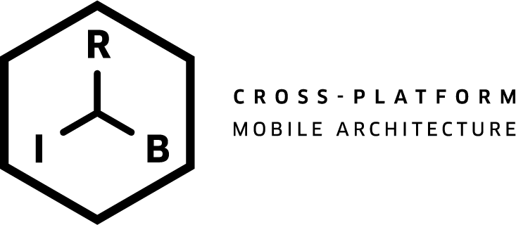

# RIBs Architecture tutorial

RIBs 에 대한 깊은 이해가 아직 부족하지만, 처음 Architecture 를 접하는 사람들에게 psuedo code 와 함께 빠른 이해를 돕고자 적어보았다 (+정리하며 다시 복습하기 위해)
차후에 이해도가 높아진다면 이 글을 다시 쓰게 될 지도 모르겠다 :(

## [RIBs?](https://github.com/uber/RIBs)



- Mobile Client Platform 의 비즈니스 로직을 공통으로 관리하기 위해 + 기존 아키텍쳐들에 대한 다양한 개선점을 반영한 아키텍쳐 from Uber
- 앱 전체의 data flow(state) 를 tree 형태로 나타내고, 앱의 상태 변화를 tree 의 자식을 detach or attach 하는 방식으로 Scoped Data 를 관리한다.
- MVC, MVP 등 View Logic 중심의 아키텍쳐에서 발생하는 View, Controller 가 비대해 지는 문제에 대해 해결 방향을 제시한다.

## RIBs & Android

- 안드로이드의 경우 iOS 와는 다르게 Activity, Service 등 Android OS 에서 기본적으로 제공되는 Component 를 사용하는 코드를 작성하게 된다.
- RIBs 의 경우 Android Fundamental Component 에 의존하기 보다는, RIBs 의 Component 에 대해 코드를 짤 수 있도록 Activity 의 존재 여부나 Service 에 대해 더 자유로운 코드를 작성하기를 원하는 것으로 보인다. (https://eng.uber.com/activity-service-dependency-android-app-architecture/)
> iOS 알못이라... 정확히 어떤 부분이 Activity, Service 를 대체하는지는 모르겠다. 다만 Cross Architecture 을 위한 로직을 목적으로하는 만큼 위와 같은 platform dependent 한 요소에 의존하는 것을 지양하고자 한다.

- RootActivity 만 존재하는 Single Acitivity Application 의 형태로 코드를 작성한다.
- Uber 의 Guide 를 기준으로 보았을 때, Service 또한 Single Service 가 Background 처리를 담당하게 하며 logic 들은 RIBs 의 Component 위에서 돌아가게 하는 방향을 권장한다.

## RIB 이란?


RIBs 는 앱 전체의 상태를 트리 형태로 나타낸다. 이때 이 트리의 각 노드들을 RIB(Router, Interactor, Builder) 이라고 한다.

> RIB 은 이름 처럼 다양한 Components 들로 이루어져 있다. 우선 각각의 노드가 어떤 역할을 하는지 확인해보자.

### Components

1. Interactor

- RIB 에서 사용되는 business logic 을 작성한다.
- 부모의 상태를 구독하며 특정 로직을 수행하거나, Interactor 와 연결된 View(=presenter) 가 있다면 해당 presenter 와 관련된 event 를 처리할 수 도 있다.
- 만약 부모의 상태를 변경하는 로직(내려오는 데이터를 수정하거나, 라우팅 자체를 변경하거나 등)이 존재한다면, two-way observe 는 코드가 복잡해 지므로, 일반적으로 Listener 를 정의하고, 부모로 부터 해당 Listener 를 주입받아 부모의 상태를 변경하는 로직을 수행한다.

```
class HappyInteractor {

    // Interface for ascending RIBs
    @Inject var listener: Listener
    // Interface for current Interactor's view(=presenter)
    @Inject var presenter: HappyPresenter

    fun didBecomeActive() {
        // Handle reactive subscribtion
        presenter.routeChildRibButtonClick()
            .subscribe {
                getRouter().attachChildRouter()
            }

        presenter.routeSiblingRibButtonClick()
            .subscribe {
                listener.changeRouting()
            }

        stateFromParentRIBs
            .subscribe {
                if (it === "happy") {
                    presenter.setHappyFace(true)
                } else {
                    presenter.setHappyFace(false)
                }
            }
    }
}
```

2. Router
- child RIB 을 붙이거나 떼어내는 routing 을 처리한다.
- Interactor 으로 부터 새로운 RIB 생성에 대한 책임을 분리하여 interactor 가 과도하게 무거워 지는 것을 방지하고 코드 결합도를 낮춰준다.

```
class HappyRouter(
    val childRibBuilder: ChildRibBuilder
) {
    var childRouter: ChildRouter? = null

    fun attachChildRouter() {
        childRouter = childRibBuilder.build()
        attachChild(childRouter)
        getView().addView(childRouter.getView())
    }

    fun detachChildRouter() {
        childRouter?.let {
            detachChild(it)
            getView().removeView(it.getView())
        }
        childRouter = null
    }
}
```

3. Builder
- Dependency Injection 을 통한 코드 결합도를 낮추기 위한 Factory 라고 볼 수 있다.
- DI 의 Scope 를 통해 지정하여, child builder 들이 필요로 하는(접근 가능한) 데이터를 제공하는 역할을 한다.
- Object 생성에 대한 책임을 오로지 Builder 만이 가지고 있으므로 Builder 만 DI library 에 대한 종속성을 가지게 되는 장점이 있다.

```
class HappyBuilder {

    fun build(parentArgs: ParentArgs): HappyRouter {
        val component = DaggerHappyBuilder_Component.builder()
            .dataFromParent(parentArgs)
            .interactor(HappyInteractor())
            .build()

        return component.happyRouter()
    }

    // Code of Providers, Modules, Components ....
}
```

4. View + Presenter (Optional)
- RIBs 의 각 노드 RIB 은 데이터에 대한(not UI) State 를 나타내는 노드들이므로, 항상 일대일 대응되는 View 를 가질 필요는 없다.
- 따라서 View 는 RIB 에서 옵셔널한 Component 로, 해당 View 에 대한 Presenter 을 통해 Interactor 에서 접근 가능한 인터페이스를 제공하는 형태로 작성 가능하다.

```
class HappyView: View(), HappyPresenter {
    // ...
    val happyButton: Button
    val emojiText: TextView

    fun buttonClick(): Observable<Unit> =
        RxView.clicks(happyButton)

    override fun setHappyFace(happy: Boolean) {
        if (happy) {
            emojiText.text = ":)"
        } else {
            emojiText.text = ":("
        }
    }
}
```

- 개인적인 생각으로는 꼭 View + Presenter 의 형태로 View Handling 을 강제할 필요는 없어 보인다.
- MVVM 에서 제공되는 ViewModel + View 의 형태로도 작성이 가능할 것 같은데... 이 View Handling Component 는 RIBs 와 독립적으로(수직하게?) 다양한 구조를 선택할 수 있을 것 같다.

---

## Back to RIBs


- 이제 앞서 설명한 RIB의 내부 구조를 잠시 제껴두고 RIB 을 하나의 데이터와 로직을 가지는 노드로 생각하자.
    - RIBs 의 각 state 는 state 를 제공하는 노드의 하위 노드들에게 제공되고 있다.
    - 또한 하위 노드들은 상위 노드의 state 에 따라서 routing(attaching) 된다. 즉 attach 될 때 하위노드는 자신이 필요한 state 데이터가 항상 제공된다는 보장하에 작동하도록 routing 을 설계할 수 도 잇다.
- 그럼 이런 구조를 통해 어떤 장점을 얻을 수 있는가?
    - 각 노드들은 자신의 상태를 하위 노드 들에게만 전달하는 형태로 코드를 작성하게 된다. 전역 변수를 통한 공유가 아닌 Scope 를 명확히 두고 변수를 공유하는 형태로 작성되기 때문에 잘못된 참조로 인해 메모리가 낭비되거나 예기치 못한 에러가 발생하는 상황들을 막아줄 수 있다.
    - 또한 트리의 형태로 dependency 가 나열되기 때문에 각 노드들에 대해  모듈화가 잘 이루어져 좋은 협업 환경을 제공할 수 있다.
